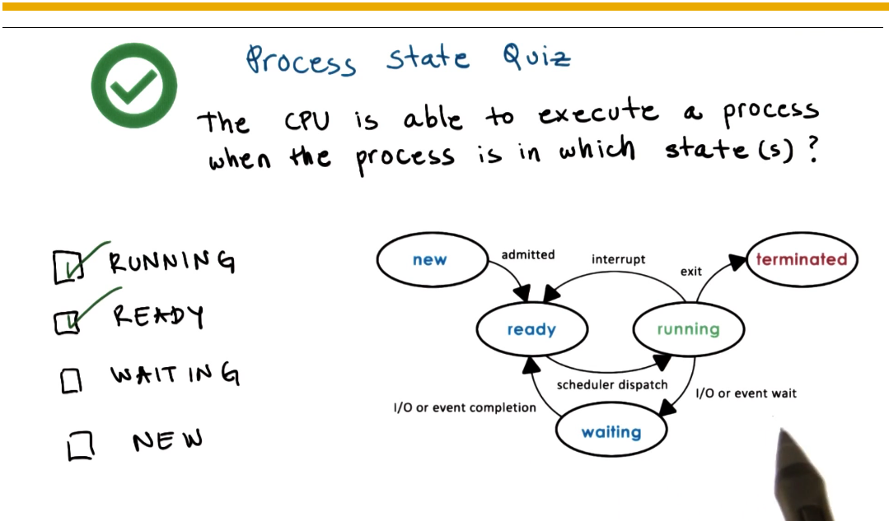
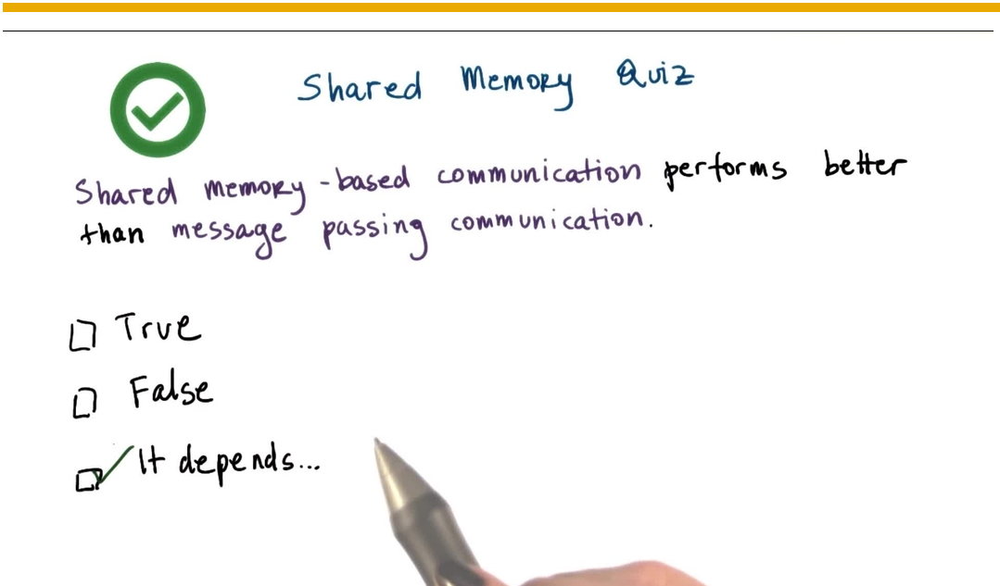

 Processes and Process Management 
============

***

[toc]

### **Topics**
- What is a process?
- How are processes represented by OS's?
- How are multiple concurrent processes managed by OS's?

## Definition:
Simple definition: A process is an instance of an executing program, synonymous with "task" or "job"
 

OS manages hardware on behalf of applications. Application is some programs stored on disk, flash memory.(**static entity**) while process is the state of a program when executing loaded in memory.(**active entity**)

## What does a Process look like?

| Process      | Address space    | Virtual Address | Physical Address |
| ------------ | ---------------- | --------------- | ---------------- |
| stack        | Vmax             |                 |                  |
| ~            | ~                |                 |                  |
| heap         | ~                |                 |                  |
| data         | ~                |                 |                  |
| text         | V0               |                 |                  |
| -            | -                | -               | -                |
| **example:** | page table entry | 0x03c5          | 0x0f0f           |
- **address space** (V0~Vmax) == Virtual address space, "in memory" representation of a process
- **page tables** == mapping of virtual to physical addresses, which are locations in physical memory

## Address Space and Memory Management 

- For each process, the operating system must maintain some information regarding the process address space, page table for instance.
- Operating system use this information to both maintain mappings between virtual addresses and the physical location where the state is actually stored.
- also to check the validity of accesses to memory, to make sure that a process is actually allowed to perform a memory access.

### Quiz: Virtual Address
The fact that we have decoupled the virtual addresses that are used by the processes from the physical addresses where data actually is makes it possible for different processes to have the exact same address space range and to use the exact same addresses. The OS will make sure that they point to distinct physical memory location if that's what's required

## Process Execution state
- Program Counter => Compiled source code
- CPU registers
- Stack pointer
- ...
==> Process Control Block (PCB)

| **Process Control Block (PCB)** |
| ------------------------------- |
| process state                   |
| process number                  |
| program counter                 |
| *registers*                     |
| memory limits                   |
| list of open files              |
| priority                        |
| signal mask                     |
| CPU scheduling info             |

-  PCB created when process is created
-  Certain fields are updated when process state changes (e.g. memory limit)
-  Other fields change too frequently (e.g. program counter, CPU will have a delicate register, which is used to track the current program counter for the currently executing process.)

It's operating system's job to make sure to collect and save all the information that the CPU maintains for a process, and to store it in the PCB structure whenever that particular process is no longer running on the CPU

### How is a PCB used?

CPU register: PCB.P1 (while P1 running) => store PCB.P1 (P1 interrupted ) & change to PCB.P2 (running P2) => re-store PCB.P1 (resume P1)

#### **context switch**
== switching the CPU from the context of one process to the context of another

They are very expensive!
  - Direct costs: number of cycles for load & store instructions
  - Indirect costs: **COLD** cache! cache misses! (L1->L2->L3) 
    - read data from memory is much slower than read from cache
- => Limit how frequency with which context switching is done

### Quiz: Hot Cache

## Process life cycle: 

### states

Process can be running or idle (ready)

### quiz: Process State Quiz

### creation

Mechanisms for process creation:
- **fork**:
  - copy the parent PCB into new child PCB
  - child continues execution at instruction after fork
- **exec**:
  - replace child image load new program and start from first instruction

### quiz: Parent Process:

## CPU scheduler

A *CPU scheduler* determines which one of the currently ready processes will be dispatched to the CPU to start running, and how long it should run for.

Operating System must:
- preempt == interrupt and save current context
- schedule == run scheduler to choose next process
- dispatch == dispatch process & switch into its context

**Must be efficient!**
- efficient design
- efficient implementation of the various algorithms that are used
- efficient data structure

### hong long should a process run for? & how frequently should we run the scheduler?

Useful CPU work:
  == total processing time / total time 
      => timeslice == time Tp allocated to a process on the CPU

Scheduling decision:
1. What are appropriate timeslice values?
2. Metrics to choose next process to run 

## What about I/O

process back to ready queue

### quiz: scheduler responsibility:

## Inter Process Communication

Inter Process Communication (IPC):
- transfer data/info between address spaces
- maintain protection and isolation
- provide flexibility and performance

Message-passing IPC:
- OS provides communication channel, like share buffer
- Processes write(send)/read(receiving) messages to/from channel
- \+ OS manages
- \- overheads

Shared memory IPC:
- OS establishes a shared channel and maps it into each process address space
- Processes directly read/write from this memory
- \+ OS is out of the way
- \- re-implement code

### quiz: shared memory

## Summary
- Process and process-related abstractions
  - address space and PCB (process control block)
- Basic mechanisms for managing process resources
  - context switching, process creation, scheduling, inter-process communication