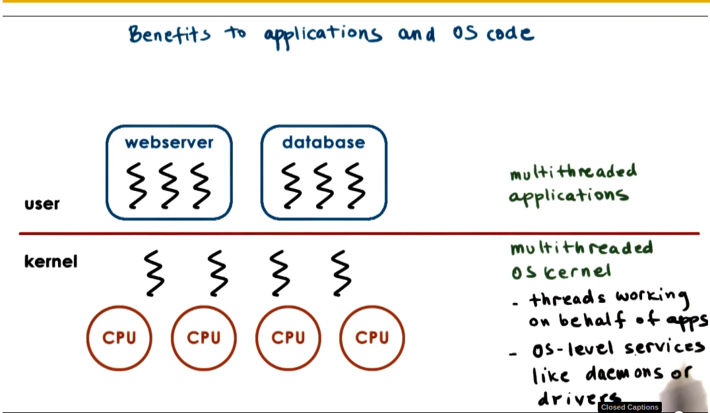
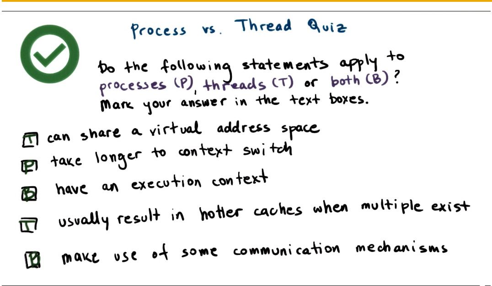
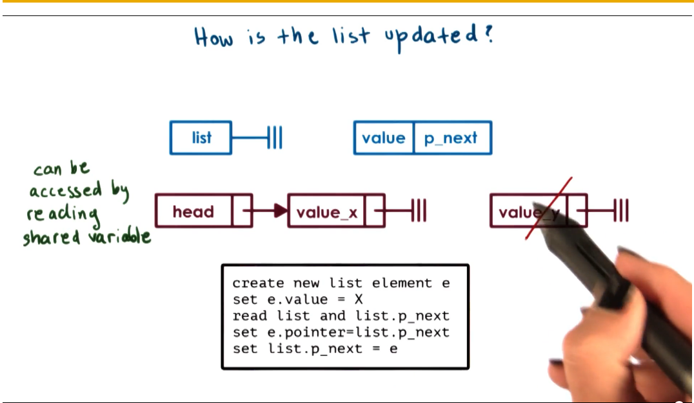
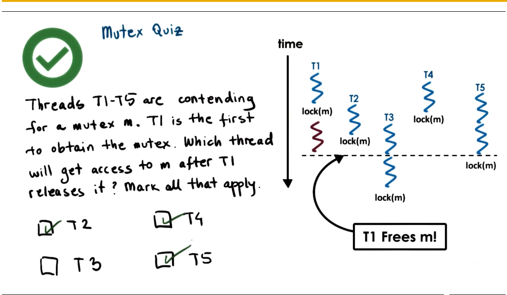
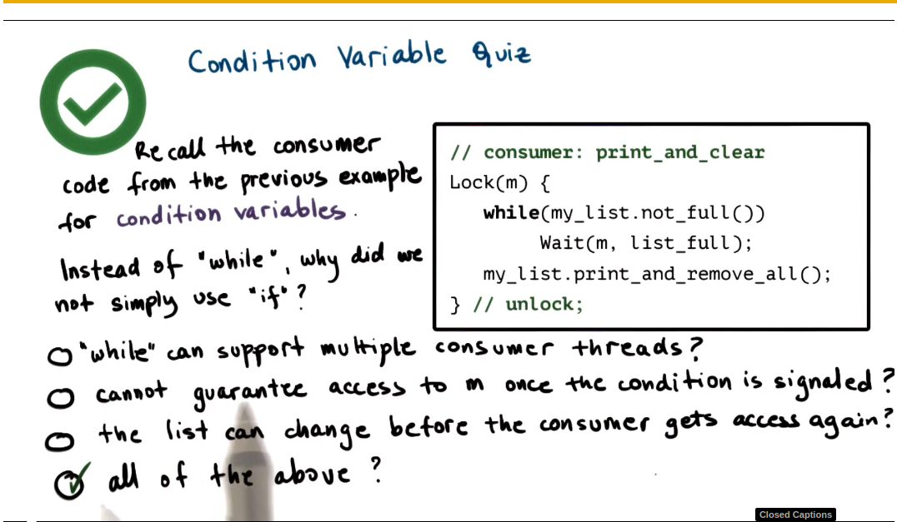
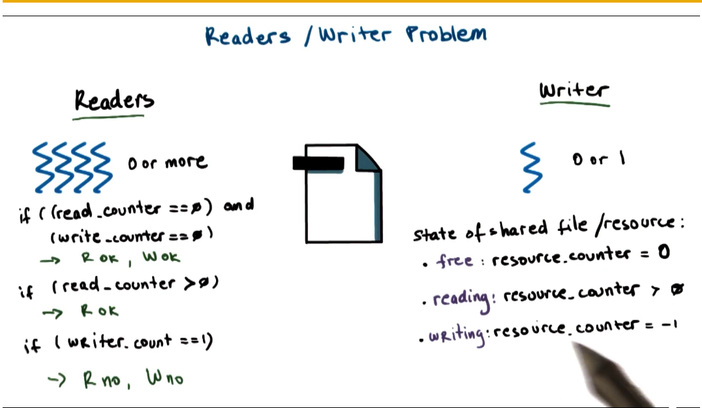
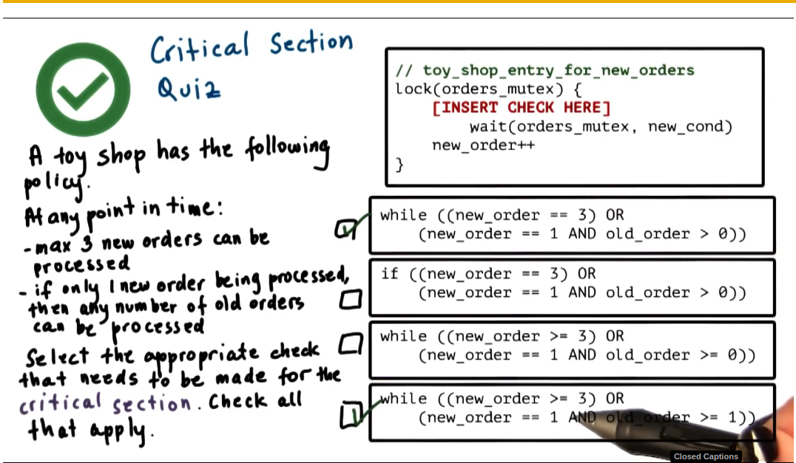

Threads and Concurrency 
============

***

[toc]

## **Topics**
- What are threads?
- How threads different from processes?
- What data structures are used to implement and manage threads?

## Definition:
A thread  is like a worker in a toy shop.


## Process vs Thread

- Thread will share the same code, data, and files.
- Each thread will need to have a different program counter, stack pointer, stack, thread-specific registers.
  - For each and every thread, we will have to have separate data structures to represent this pre-thread information.


### Benefits of Multithreading
- parallelization ==> Speed up 
- specialization ==> hot cache!
  - Multi-process vs Multi-threading
  - Multi-process require address space & execution context, while Multi-thread can share address space. In that case, multi-thread is **more memory efficient** and **communicating data among processes are more costly** (shared address space)
- Multi-thread are more efficient in their requirement than multi-process program

#### Are threads useful on a Singe CPU
**hide latency**
- if *t_idle* > 2*(*t_ctx_stitch* ), then context switch to hide idling time
- *t_ctx_switch* threads < *t_ctx_switch* processes 
  - this is because when context switch processes, one of the most costly step is to create new virtual to physical address mappings. But threads shared the address space, which can avoid the mapping time.

#### Benefits to applications and OS code



### quiz: process vs threads



## Basic Thread Mechanisms

1. ***thread data structure***
  identify threads, keep track of resource usage...
2. mechanisms to ***create*** and ***manage*** thread
3. mechanisms to safely ***coordinate*** among threads running ***concurrently*** in the same address space

### Concurrency control and coordination
#### synchronization mechanisms
- Mutual Exclusion 
  - exclusive access to only one thread at a time
  - **mutex**
- waiting on other threads 
  - Specific condition before proceeding 
  - **condition variable**

### Thread creation

thread type == thread data structure (thread ID, PC|program counter, SP, registers, stack|args, attributes)

**fork(proc, args)**
  - create a thread
    - proc: procedure that the created thread will start executing
    - args: arguments for this procedure
  - not UNIX fork

**join(thread)**
- When parent thread calls join with the thread ID of the child thread, it will be blocked until the child completes.
- Without join, the parent and child are completely equivalent 

### Mutexes (Mutual Exclusion)



Parent and child thread may update the shared list at the same time

**Mutex** == lock 

The portion of the code protected by the the mutex is called critical section

| Mutex data structure |
| -------------------- |
| status:locked?       |
| owner                |
| blocked_threads      |

#### quiz: mutexes



#### Producer/Consumer example

What if the processing you with to perform with *mutual exclusion* needs to occur only under *certain condition*?

```c
// main
for i = 0..10
  producers[i] = fork(safe_insert, NULL) // create producers
consumer = fork(print_and_clear, my_list) // create consumer

// producers: safe_insert
Lock(m){
  list->insert(my_thread_id)
} // unlock

// consumer: print_and_clear
Lock(m){
  if my_list.full -> print; clear up to limit of elements of list
  else -> release lock and try again (later)
}
```

### Condition variable

```c
 //consumer: print_and_clear
Lock(m){
  while(my_list.not_full())
Wait(m, list_full);
  my_list.print_and_remove_all()
} //unlock
```
```c
// producer: safe_insert
Lock(m){
  my_list.insert(my_thread_id);
  if my_list.full()
    Signal(list_full);
} //unlock
```

#### condition variable API

condition type:

- wait(mutex, cond)
  - mutex is automatically released & re-acquired on wait
<br>

- signal(cond)
  - notify only one thread waiting on condition
- broadcast(cond)
  - notify all waiting threads
  

| Condition Variable |
| ------------------ |
| mutex ref          |
| waiting threads    |

```c
Wait(mutex, cond){
  // atomically release mutex
  // and go to wait queue

  //...wait ... wait ... wait ...

  // remove from queue
  // re-acquire mutex
  // exit the wait operation
}
```

#### quiz: condition variable



### readers/writer problem




**Mutex** counter_mutex; **Condition** read_phase, write_phase; **int** resource_counter = 0

```c
// readers
Lock(counter_mutex){
  while(resource_counter == -1)
    Wait(counter_mutex, read_phase);
  resource_counter++;
} // unlock;
// ... read data ... # critical section
Lock(counter_mutex){
  resource_counter--;
  if(resource_counter == 0)
   Signal(write_phase)
} // unlock
```

```c
// writer
Lock(counter_mutex){
  while(resource_counter!=0)
    Wait(counter_mutex, write_phase);
  resource_count = -1;
} // unlock
// ... writer data ... # critical section
Lock(counter_mutex){
  resource_counter = 0;
  Broadcast(read_phase);
  Signal(write_phase);
}// unlock;
```

#### Critical Section Structure

```c
Lock(mutex){
  while(!predicate_indicating_access_ok)
    wait(mutex,cond_var)
  update state => update predicate
  signal and/or broadcast
    (cond_var_with_correct_waiting_threads)
} // unlock
```

#### Critical Section Structure with proxy variable
```c
// enter critical section 
perform critical operation (read/write shared file)
// exit critical section

//enter critical section
Lock(mutex){
  while(!predicate_for_access)
    wait(mutex, cond_var)
  update predicate
}//unlock;

//exit critical section
Lock(mutex){
  update predicate;
  signal/broadcast(cond_var)
}// unlock
```

#### common mistakes
- keep track of mutex/cond.variables used with a given resource
  - e.g. mutex_type m1 ==> mutex for file1
- check that you are always(and correctly) using lock&unlock
  - e.g. did you forget to lock/unlock? 
- use a single mutex to access a single resource!
  - ```lock(m1){//read file1}//unlock & lock(m2){..write file1}//unlock```
  - read and write allowed to happen concurrently
- check that you are signaling correct condition
- check that you are not using signal when broadcast is needed
- Ask yourself: do you need priority guarantees?
  - thread execution order not controlled by signal to condition variables
- spurious wake up & deadlock

##### spurious wake up
Spurious wake up == when we wake threads up knowing they may not be able to proceed.
may impact performance

##### deadlocks
Definition: Two or more competing threads area waiting on each other to complete, but none of them ever do

How to avoid this?
- unlock A before locking B
  - fine-grained locking ==> not working because both thread need A&B
- get all locks upfront, then release at the end
  - Use one mega lock
  - works for some application
  - too restrictive => limit parallelism
- maintain lock order
  - first m_A, then m_B
  - will prevent cycles in the lock
  - works

Summary: A cycle in the wait graph is necessary and sufficient for a deadlock to occur. (edges from thread waiting on a resource to thread owning a resource)

What can we do about it?
- Deadlock prevention => expensive
- Deadlock detection & recovery => require rollback
- apply the ostrich algorithm => do nothing => if all else fails, just reboot

#### quiz: critical section 


## Kernel vs User-level thread

What's the relationship between kernel-level and user-level thread? (user-> kernel)
1. one-to-one model
   - (+): OS sees/understands threads, synchronization, blocking
   - (-): must go to OS for all operations (may be expensive)
   - (-): OS may have limits on policies, threads#
   - (-): portability
2. many-to-one model
   - (+): totally portable, doesn't depend on OS limits & policies
   - (-): OS has no insight into application needs
   - (-): OS may block entire process if one user-level blocks on I/O
3. many-to-many model
   - (+): can be best of both worlds
   - (+): can have bound or unbound threads
   - (-): requires coordination between user and kernel level thread managers

### scope of multithreading
  
Process Scope:
- user-level library managers threads within a single precess

System scope:
- System-wide thread management by OS-level thread managers (e.g. CPU scheduler)


### multithreading patterns
- boss-workers
- pipeline
- layered

#### boss-workers pattern

- boss:assigns work to workers
- worker: performs entire task
- throughput == 1/boss_time_per_order
- boss-workers communicate via producer/consumer queue
- worker pool: static or dynamic

Boss-worker variants
- all workers created equal 
- works specialized for certain tasks


#### pipeline pattern
- threads assigned one subtask in the system
- entire tasks == pipeline of threads
- multiple tasks concurrently in the system, in different pipeline stages
- throughput == weakest link
  - => pipeline stage == thread pool
- shared-buffer based communication between stages

<br>

- (+): specialization and locality
- (-): balancing and synchronization overheads

#### layered pattern
- each layer group of related subtasks
- end-to-end task must pass up and down through all layers

<br>

- (+): specialization
- (+): less fine-grained than pipeline
- (-): not suitable for all application 
- (-): synchronization

#### quiz: multithreading pattern


## Summary
- What are threads?
  - how and why do we use them?
- Thread mechanisms
- Using Threads
  - problems & solutions