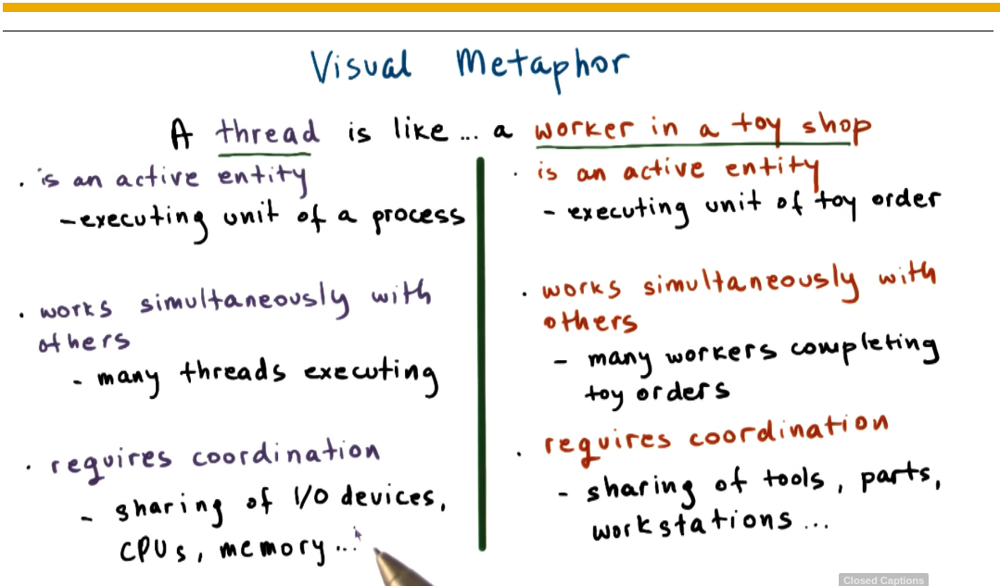
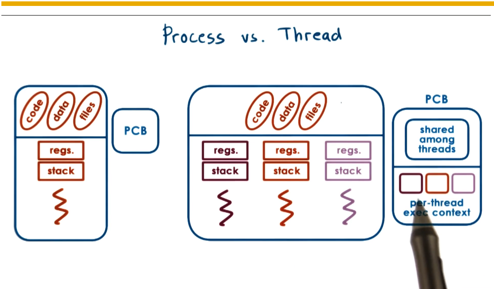

Threads and Concurrency 
============

***

[toc]

## **Topics**
- What are threads?
- How threads different from processes?
- What data structures are used to implement and manage threads?

## Definition:
A thread  is like a worker in a toy shop.

## Process vs Thread

- Thread will share the same code, data, and files.
- Each thread will need to have a different program counter, stack pointer, stack, thread-specific registers.
  - For each and every thread, we will have to have separate data structures to represent this pre-thread information.

### Benefits of Multithreading
- parallelization ==> Speed up 
- specialization ==> hot cache!