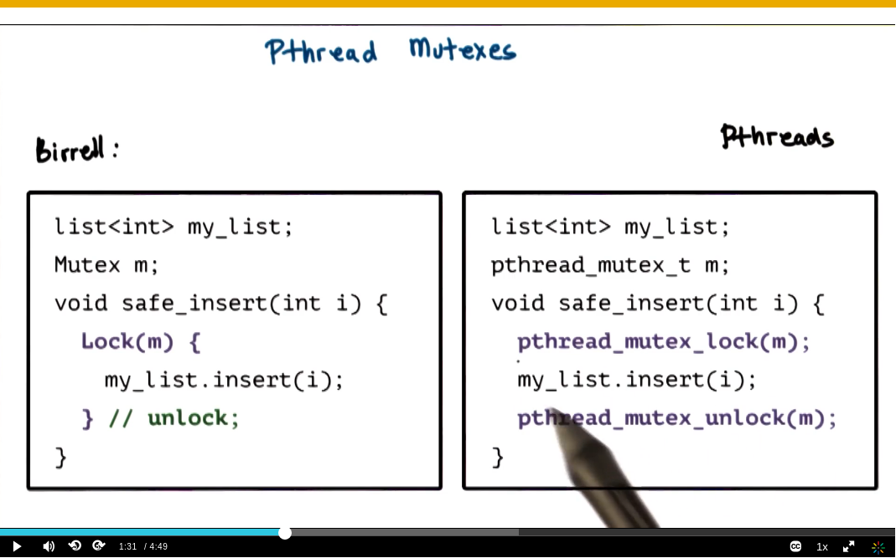

Threads case study: PThread
============

***

[toc]

## **Topics**
- PThreads = POSIX Thread
  - POSIX == portable operating system interface
    - POSIX version of Birrell's API
    - specifies syntax and semantics of the operation


## Pthread creation


### Pthread attributes
```c
int pthread_create(pthread_t *thread,
            const pthread_attr_t *attr,
            void * (*start_routine)(void *),
                void *arg);
```

Pthread_attr_t
- specified in pthread_create
- defines features of the new thread
  - stack size, scheduling policy, priority, inheritance, ***joinable***, system/process scope
- has default behavior with NULL in pthread_create

```c
int pthread_attr_init(pthread_attr_t *attr);
int pthread_attr_destroy(pthread_attr_t *attr);
pthread_attr_{set/get}{attribute}
```

detached & joinable threads


```c
#include <stdio.h>
#include <pthread.h>

void *foo (void *arg) {/* thread main*/
  printf("Foobar!\n");
  pthread_exit(NULL);
}

int main (void) {

  int i;
  pthread_t tid;

  pthread_attr_t attr;
  pthread_attr_init(&attr); /* required!!!*/
  pthread_attr_setdetachstate(&attr, PTHREAD_CREATE_DETACHED);
  pthread_attr_setscope(&attr, PTHREAD_SCOPE_SYSTEM);
  pthread_create(NULL, &attr, foo, NULL);

  return 0
}
```

### Compiling Pthread

1. ``` # include <pthread.h>```
2. compile source with -lpthread or -pthread
    ``` intro to OS ~ ==> gcc -o main main.c -lpthread```
    ``` intro to OS ~ ==> gcc -o main main.c -pthread```

3. check return values of common features

### quiz: Pthread creation

#### q1


#### q2


- "i" is defined in main function => it's globally visible variable
- when it changes in one thread => all other threads see new values!
- data race or race condition => thread tries to read a value, while another thread modifies it!

slightly modified version
```c
#define NUM_THREADS 4

void *threadFunc(void *pArg){ /* thread main*/
    int myNum = *((int*)pArg)
    printf("Thread number %d\n", myNum);
    return 0;
}

int main(void){
  int tNum[NUM_THREADS];
  // ...
  for(i =0; i<NUM_THREADS;i++){/* create/fork threads */
    tNum[i] = i
    pthread_create(&tid[i],NULL,threadFunc,&tNum[i]);
  }
  //...
}
```

#### q3


## Pthread Mutexes

"to solve mutual exclusion problems among concurrent threads"



### other mutex operations
```c
int pthread_mutex_init(pthread_mutex_t *mutex, 
                      const pthread_mutexattr_t *attr);
// mutex attributes == specifies mutex behavior when a mutex is shared among processes
```

```c
int pthread_mutex_trylock(pthread_mutex_t *mutex);
```

```c
int pthread_mutex_destroy(pthread_mutex_t *mutex);
```

### mutex safety tips
- shared data should be always be accessed through a single mutex
- mutex scope must be visible to all!
- globally order locks
  - for all threads, lock mutexes in order
- always unlock a mutex
  - always unlock the correct mutex

## Pthread condition variables


### other condition variable operations

init
```c
int pthread_cond_init(pthread_cond_t *cond,
                      const pthread_condattr_t *attr);
// attributes --e.g. if it's shared
```

destroy
```c
int pthread_cond_destroy(pthread_cond_t *cond);
```

### condition variable safety tips

- Do not forget to notify waiting threads!
  - predicate change => signal/broadcast correct condition variable
- When in doubt broadcast
  - but performance loss
- You do not need a mutex to signal/broadcast

## Producer - Consumer example

[producer_consumer_example](../ud923-p2l3-pthreads/producer-consumer.c)

## Summary

- Pthread vs Birrel's paper
  - Threads, Mutexes, and Condition Variables
  - Safety tips
  - Compilation and examples